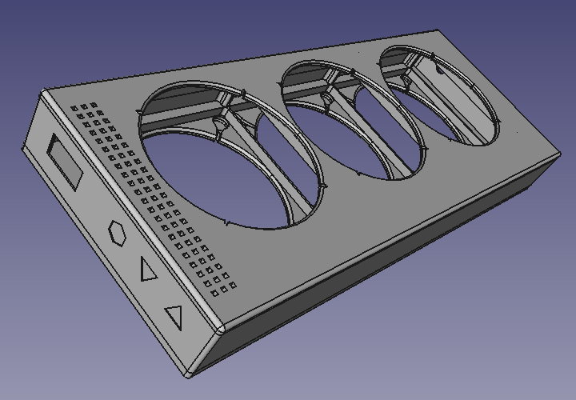

# 3D-модели

На текущий момент в проекте присутствует только одна модель корпуса для печати на 3D-принтере.

## EHEIM vivalineLED 126

### 3 x 92 мм. вентиляторы

Исходники модели в формате `FreeCAD` лежат в директории `3d-model/eheim-vivaline-126` проекта ([3x92-full.FCStd.xz](3d-model/eheim-vivaline-126/3x92-full.FCStd.xz)). Там же находятся готовые к печати `stl` файлы:

* [3x92-bottom.stl.xz](3d-model/eheim-vivaline-126/3x92-bottom.stl.xz) - низ корпуса, подоходит для всех вариантов верха;
* [3x92-top-power.stl.xz](3d-model/eheim-vivaline-126/3x92-top-power.stl.xz) - верх корпуса с единственным отверстием под гнездо питания, может использоваться если у вас уже есть внешний контроллер и не хватает только блока вентиляторов;
* [3x92-top-ds18b20.stl.xz](3d-model/eheim-vivaline-126/3x92-top-ds18b20.stl.xz) - верх корпуса с отверстием под аудио-гнездо 3.5 мм. датчика `DS18B20`, может использоваться если вам не требуется индикация параметров работы на дисплее;
* [3x92-top-display.stl.xz](3d-model/eheim-vivaline-126/3x92-top-display.stl.xz) - верх корпуса с дисплеем, может использоваться если вам нужна индикация работы, но не требуется настройка парамеров;
* [3x92-top-buttons.stl.xz](3d-model/eheim-vivaline-126/3x92-top-buttons.stl.xz) - верх корпуса с кнопками, наиболее полный вариант.

Объем модели (`FreeCAD.ActiveDocument.ActiveObject.Shape.Volume / 1000`) составляет приблизительно 305 см³. Отпечатана в типографии [replica-3d.ru](https://replica-3d.ru) без склеек.

### Как можно помочь?

Буду рад вашим PR с новыми моделями корпусов под другие типы аквариумов или количество вентиляторов.
