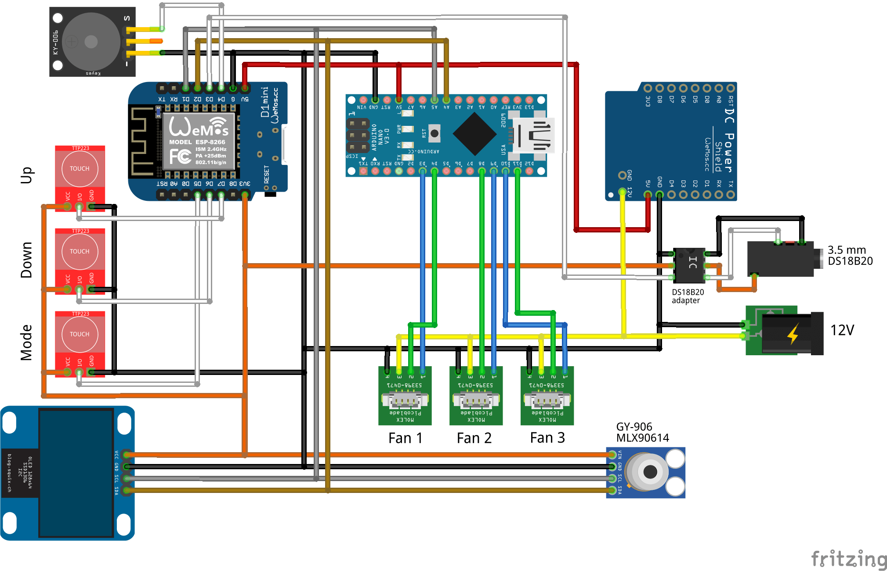

# Электрическая схема

Контроллер может быть собран по двум схемам:

* На базе одной платы `Arduino Nano` (без поддержки WiFi)
* На базе двух плат `Arduino Nano` и `Wi-Fi Wemos D1 Mini` (с поддержкой WiFi)

Поддержка WiFi полезна только при активной разработке (перепрошивка через `OTA` без необходимости вскрытия корпуса и подключения к плате через USB). В обычной же жизни ("один раз настроил и забыл") эта возможность будет настолько редко востребованной, что усложнение схемы ради нее видится нецелесообразным.

Обе схемы отображают подключение коннекторов для 3-х вентиляторов. В случае использования меньшего количества вентиляторов можно просто убирать из схемы неиспользуемые (начиная с 3-го).

Обе схемы отображают подключение двух датчиков температуры воды:

* `DS18B20` (через адаптер и аудио-коннектор 3.5 мм.);
* Инфракрасный `GY-906` (`MLX90614`).

ПО может работать как с обоими датчиками одновременно, так и с любым из них. [Практические испытания](sensor-matrix.md) показали, что датчик `GY-906` достаточно сильно "шумит" из за внешних воздействий и, если вам не требуется дополнительный контроль по второму датчику, его можно исключить из схемы. Так же, если будет сделан выбор в пользу ИК-датчика `GY-906` (и неприемлемости погружения в воду `DS18B20` например, из соображений эстетики), можно исключить из схемы аудио-гнездо 3.5 mm и адаптер `DS18B20`.

Помимо датчика `GY-906` по шине I2C можно подключить любые дополнительные датчики по вашему усмотрению аналогично подключению `GY-906` (на данный момент эта возможность носит экспериментальный характер).

Дисплей `SSD1306 128x64` и сенсорные кнопки `TTP223` являются опциональными - все параметры ПО можно задать на этапе компиляции. Если вам не требуется визуальное отображение информации или не требуется изменение настроек (конфигурирования температуры, ограничения мощности вентиляторов и т.д.), то дисплей и / или кнопки можно исключить из схемы.

Обе схемы отображают подключение зуммера ("пищалки") `KY-006` для звуковой сигнализации о различных событиях (ошибка вентиляторов, критическое повышение температуры и т.д.). На данный момент ПО не поддерживает эту возможность, однако не исключена поддержка в будущем. Зуммер так же можно исключить из схемы.

Крепление плат в [корпусе](3d-model.md) производится на термоклей (поскольку отпечатать на 3D-принтере ровные аккуратные крепления не представляется возможным), монтаж навесной проводами типа `dupont` (для цветовой маркировки и / или возможности размыкания узлов). В случае необходимости демонтажа для термоклея можно использовать изопропиловый спирт.

## Схема 1

Схема с одной платой без поддержки WiFi.

## Схема 2

Схема с двумя платами и поддержкой WiFi.

## Прочее

### DS18B20

При использовании датчика `DS18B20` аудио-штекер 3.5 мм. рекомендуется распаивать совместимым с датчиком `Sonoff` (который поставляется с уже распаяным штекером).

* `DATA` - данные (белый)
* `GND` - земля (черный)
* `VCC` - питание (красный +5V, оранжевый +3V, у датчика `Taidacent` - розовый)

При монтаже гнездо и штекер имеет смысл прозвонить мультиметром на соответствие контактов.

### KF2510-4AW

Штекер `KF2510-4AW` имеет ключ для корректного подключения вентилятора. Распайка штекера и гнезда приведена ниже:

* `Ground` - земля (черный)
* `+12V` - питание (на схеме желтый)
* `Tach` - показания тахометра (на схеме зеленый)
* `PWM` - управление скоростью вращения (голубой)

## Как можно помочь?

Схемы созданы с использованием [fritzing.app](https://github.com/fritzing/fritzing-app), исходники лежат в директории `schema` проекта:

* [1-board.fzz](schema/1-board.fzz) - схема 1 (одна плата)
* [2-board.fzz](schema/2-board.fzz) - схема 2 (две платы)

Поскольку я делал это первый раз в жизни (как и держал пяльник), буду рад вашим PR с улчшениями.
