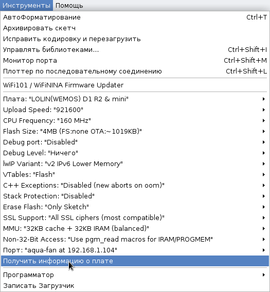

# Программное обеспечение

Исходный код находится в директории `src` проекта. Для сборки используется среда [Arduino IDE](https://www.arduino.cc/en/software) со следующими дополнительными библиотеками:

* [SoftTimers](https://github.com/end2endzone/SoftTimers);
* [GyverOLED](https://github.com/GyverLibs/GyverOLED);
* [GyverPWM](https://github.com/GyverLibs/GyverPWM);
* [EnableInterrupt](https://github.com/GreyGnome/EnableInterrupt).

Для работы с датчиками температуры используются следующие библиотеки:

* [OneWire](https://www.pjrc.com/teensy/td_libs_OneWire.html) - `DS18B20`;
* [DallasTemperature](https://github.com/milesburton/Arduino-Temperature-Control-Library) - `DS18B20`;
* [Adafruit-MLX90614-Library](https://github.com/adafruit/Adafruit-MLX90614-Library) - `GY-906` (`MLX90614ESF`).

Для работы в [схеме с двумя платами](schema.md) и поддержкой WiFi используются следующие библиотеки:

* [ESP8266 Arduino](https://arduino-esp8266.readthedocs.io/en/latest/);
* [ArduinoJSON](https://arduinojson.org/v6/api/).

Для работы с внешними (экспериментальными) датчиками используются следующие библиотеки:

* [Adafruit BME280 Library](https://github.com/adafruit/Adafruit_BME280_Library) - `BME280`;
* [arduino-sht](https://github.com/Sensirion/arduino-sht) - `SHT-3X` (`SHT-30`, `SHT-31`, `SHT-35`, `SHT-85`);
* [BH1750](https://github.com/claws/BH1750) - `BH1750`.

Все эти библиотеки могут быть установлены через менеджер библиотек `Arduino IDE`.

## Конфигурация

Конфигурация ПО задается в файле [config.h](src/config.h) через `#define` опции:

* `DISPLAY_TYPE` - тип дисплея:
  * (не задано) - система собирается и работает без поддержки дисплея и кнопок;
  * `DISPLAY_SSD1306_128_64` - поддержка дисплея `SSD1306 128x64` (включено по умолчанию в `config.h`).
* `PRIMARY_WATER_TEMPERATURE_SENSOR` - тип первичного (основного) датчика температуры воды:
  * `WATER_TEMPERATURE_SENSOR_DS18B20` - `DS18B20` (включено по умолчанию в `config.h`);
  * `WATER_TEMPERATURE_SENSOR_MLX90614` - `GY-906` (`MLX90614ESF`).
* `SECONDARY_WATER_TEMPERATURE_SENSOR` - типы вторичного (дополнительного) датчика температуры воды:
  * (не задано) - вторичный датчик отсутствует (по умолчанию);
  * остальные возможные значения такие же как у `PRIMARY_WATER_TEMPERATURE_SENSOR`.
* `ENABLE_WIFI` - включение [схемы с поддержкой WiFi](schema.md) (по умолчанию не задано):
  * `WIFI_SSID` - имя `SSID` для подключения к WiFi сети (по умолчанию не задано);
  * `WIFI_PASSWORD` - пароль для подключения к WiFi сети (по умолчанию не задано).

Экспериментальные опции:

* `EXTERNAL_SENSOR_0`, `EXTERNAL_SENSOR_1`, `EXTERNAL_SENSOR_2` - внешние сенсоры (по умолчанию не заданы):
  * `EXTERNAL_SENSOR_BME280` - датчик `BME280` (температура, влажность, давление);
  * `EXTERNAL_SENSOR_SHT3X` - датчик `SHT-3X` (температура, влажность).

### Контроллер

Значения ниже не используются, если они были сконфигурированы и сохранены в `EEPROM` (кнопками).

* `DEFAULT_WATER_TEMPERATURE_BASE` - базовая температура воды для поддержания в °C (по умолчанию 25);
* `DEFAULT_MIN_FAN_SPEED` - минимально разрешенная скорость вентиляторов в процентах (по умолчанию 0);
* `DEFAULT_MAX_FAN_SPEED` - максимально разрешенная скорость вентиляторов в процентах (по умолчанию 80).

Значения ниже не рекомендуются к изменению:

* `FAN_SPEED_TEMPERATURE_WINDOW` - ширина окна температур в °C в котором скорость вентиляторов меняется от 0 до 100% (по умолчанию 0.5);
* `WATER_TEMPERATURE_SENSOR_NOISE` - шум датчика в °C (по умолчанию 0.1 для `DS18B20` и 0.3 для `MLX90614`);
* `WATER_TEMPERATURE_SENSOR_NOISE_UPPER` - шум датчика в °C в сторону завышения показаний температуры (по умолчанию `WATER_TEMPERATURE_SENSOR_NOISE`);
* `WATER_TEMPERATURE_SENSOR_NOISE_LOWER` - шум датчика в °C в сторону занижения показаний температуры (по умолчанию `WATER_TEMPERATURE_SENSOR_NOISE`);
* `FAN_SPEED_NOISE_MULTIPLER` - основание логарифма для модели изменения скорости вращения вентиляторов (по умолчанию не задано - используется линейная модель, эквивалентная `FAN_SPEED_NOISE_MULTIPLER = 1`). Динамика изменения скорости вращения вентиляторов в зависимости от значения и разницы температур изображена на диаграме ниже. Значения более единицы подходят для очень тихих вентиляторов и удержания температуры в узком диапазоне. Значения менее единицы могут использоваться для шумных вентиляторов, но тогда придется пожертвовать диапазоном регулирования. На экспериментальном стенде стандартная линейная модель показала себя вполне адекватно и установка данной переменной в обычных условиях не требуется. Определение опции `FAN_SPEED_NOISE_HUMIDITY` (по умолчанию не задано) позволяет динамически изменять `FAN_SPEED_NOISE_MULTIPLER` в зависимости от влажности воздуха, где 100% влажности транслируется в значение 10 и значение 0.1 при влажности воздуха менее 1%.

<p align='center'>

</p>

Алгоритм управления вентиляторами:

* Вентиляторы стартуют, если температура повысилась до значения `DEFAULT_WATER_TEMPERATURE_BASE` + `WATER_TEMPERATURE_SENSOR_NOISE_UPPER`;
* Вентиляторы останавливаются, если температура понизилась до значения `DEFAULT_WATER_TEMPERATURE_BASE` - `WATER_TEMPERATURE_SENSOR_NOISE_LOWER`;
* Вентиляторы работают на 100% мощности при превышении температуры `DEFAULT_WATER_TEMPERATURE_BASE` + `FAN_SPEED_TEMPERATURE_WINDOW`;
* Вентиляторы меняют скорость работы от 0 до 100% в диапазоне температур остановки и максимальной мощности.

### Датчики

**Общие параметры**

Значения ниже не рекомендуются к изменению:

* `FAST_SENSOR_UPDATE_INTERVAL` - время обновления показаний для "быстрых" датчиков в ms (по умолчанию 1000 = 1s);
* `STANDARD_SENSOR_UPDATE_INTERVAL` - время обновления показаний для "стандартных" датчиков в ms (по умолчанию 3000 = 3s);
* `SLOW_SENSOR_UPDATE_INTERVAL` - время обновления показаний для "медленных" датчиков в ms (по умолчанию 15000 = 15s).

**DS18B20**

* `ONE_WIRE_PIN` - номер `OneWire` пина для датчика (значение по умолчанию зависит от типа [схемы](schema.md), нельзя использовать пины D0 и D8 для платы `ESP8266`);
* `DS18B20_WATER_TEMPERATURE_SENSOR_INDEX` - индекс датчика (по умолчанию 0);
* `DS18B20_WATER_TEMPERATURE_SHIFT` - поправка датчика в °C (по умолчанию 0).

Значения ниже не рекомендуются к изменению:

* `DS18B20_WATER_TEMPERATURE_FILTER` - коэффициент IIR фильтра (по умолчанию 22, что соответствует ~5 минутам для стабилизации показаний при интервале обновления раз в 3s значения `STANDARD_SENSOR_UPDATE_INTERVAL`).

**MLX90614**

* `MLX90614_WATER_TEMPERATURE_SHIFT` - поправка датчика температуры объекта в °C (по умолчанию 0);
* `MLX90614_AMBIENT_TEMPERATURE_SHIFT` - поправка датчика температуры окружающего воздуха в °C (по умолчанию 0).

Значения ниже не рекомендуются к изменению:

* `MLX90614_WATER_TEMPERATURE_FILTER` - коэффициент IIR фильтра (по умолчанию 65 что соответствует ~5 минутам для стабилизации показаний при интервале обновления раз в 1s значения `FAST_SENSOR_UPDATE_INTERVAL`);
* `MLX90614_WATER_TEMPERATURE_MAX_FAILS` - максимальное число попыток измерения температуры объекта, прежде чем датчик будет переведен в режим ошибки (по умолчанию `MLX90614_AMBIENT_TEMPERATURE_MAX_FAILS`);
* `MLX90614_AMBIENT_TEMPERATURE_MAX_FAILS` - максимальное число попыток измерения температуры окружающего воздуха, прежде чем датчик будет переведен в режим ошибки (по умолчанию 60000 / `FAST_SENSOR_UPDATE_INTERVAL` = 60 попыток или 1 минута).

**BME280**

* `BME280_AMBIENT_TEMPERATURE_SHIFT` - поправка датчика температуры окружающего воздуха в °C (по умолчанию 0);
* `BME280_HUMIDITY_SHIFT` - поправка датчика влажности окружающего воздуха в % (по умолчанию 0);
* `BME280_PRESSURE_SHIFT` - поправка датчика давления окружающего воздуха в Па (по умолчанию 0).

**SHT-3X**

* `SHT3X_AMBIENT_TEMPERATURE_SHIFT` - поправка датчика температуры окружающего воздуха в °C (по умолчанию 0);
* `SHT3X_HUMIDITY_SHIFT` - поправка датчика влажности окружающего воздуха в % (по умолчанию 0).

**BH1750**

* `BH1750_LIGHT_SHIFT` - поправка датчика освещения в Lx (по умолчанию 0).

### Вентиляторы

* `FAN_COUNT` - количество вентиляторов (от 1 до 3, по умолчанию 3).

Значения ниже не рекомендуются к изменению:

* `FAN0_TAC` - номер пина tac (тахометр) для 1-го вентилятора (по умолчанию 4);
* `FAN1_TAC` - номер пина tac (тахометр) для 2-го вентилятора (по умолчанию 8);
* `FAN2_TAC` - номер пина tac (тахометр) для 3-го вентилятора (по умолчанию 11);
* `FAN_PWM_FREQ` - несущая частота pwm, Hz (по умолчанию 25000 = 25kHz);
* `FAN_UPDATE_INTERVAL` - интервал снятия показаний тахометра в ms (по умолчанию 2000 = 2s);
* `FAN_I2C_ADDRESS` - I2C адрес slave платы управления вентиляторами в схеме с двумя платами.

Из за особенностей генерации pwm, номера pwm-пинов жестко фиксированы на 3, 9 и 10.

### Дисплей

Дисплей неактивен, если не задан `DISPLAY_TYPE`.

* `DISPLAY_ADDRESS` - I2C адрес дисплея (по умолчанию `0x3C`).

Значения ниже не рекомендуются к изменению:

* `DISPLAY_UPDATE_INTERVAL` - время обновления информации на дисплее в ms (по умолчанию 1000 = 1s).

### Кнопки

Кнопки неактивны, если не задан `DISPLAY_TYPE`.

* `BUTTON_MODE_PIN` - номер пина для кнопки выбора режима (значение по умолчанию зависит от типа [схемы](schema.md));
* `BUTTON_DOWN_PIN` - номер пина для кнопки "вниз" (значение по умолчанию зависит от типа [схемы](schema.md));
* `BUTTON_UP_PIN` - номер пина для кнопки "вверх" (значение по умолчанию зависит от типа [схемы](schema.md)).

## Сборка

* Перед загрузкой ПО на плату отключите вентиляторы из схемы;
* Соедините нужную плату с компьютером через USB;
* Откройте проект в `Arduino IDE` и выберете нужный тип платы;
* Скомпилируйте и загрузите проект.

В случае использования двух плат рекомендуемые параметры сборки для `Wi-Fi Wemos D1 Mini`:

<p align='center'>

</p>

После первичной прошивки в дальнейшем можно использовать прошиву через `OTA` (по WiFi). Для этого может потребоваться разрешить на firewall компьютера трафик для `mDNS` и `OTA`. В терминах `iptables`:

```
# allow mdns
-A INPUT -d 224.0.0.251/32 -p udp -m udp --dport 5353 -j ACCEPT

# allow ota
-A INPUT -s 192.168.1.XXX/32 -p udp -j ACCEPT
-A INPUT -s 192.168.1.XXX/32 -p tcp -j ACCEPT
```

где `192.168.1.XXX` - адрес, назначенный WiFi плате.

## Как можно помочь?

Буду раз вашим PR с новыми функциями и исправлением ошибок.
